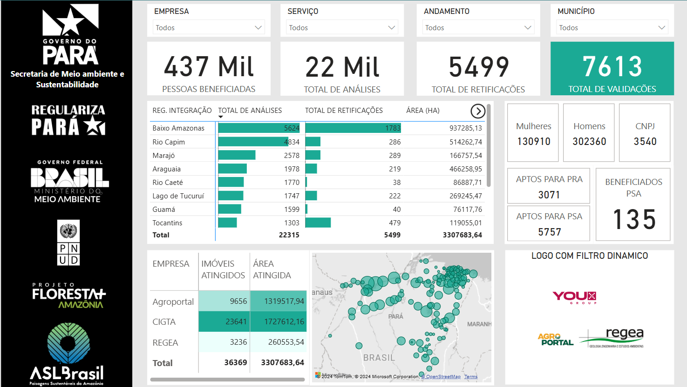

# Relatórios Power BI de Samuel Santos

Bem-vindo ao repositório de **Relatórios Power BI**! Aqui estão exemplos de dashboards que desenvolvi para monitoramento e suporte à tomada de decisão em diversas áreas, como gestão ambiental, conservação da vegetação nativa, e gestão de contratos. Cada projeto utiliza o Power BI como ferramenta principal para transformar dados em insights.

---

## Relatórios e Dashboards

### [Relatório de Iniciativas e Resultados da Diretoria de Geotecnologias (DIGEO/SEMAS-PA)](https://app.powerbi.com/view?r=eyJrIjoiMzJhMTg4NzItMmI5Ny00YjQwLTgzN2UtOWQxMzU1M2JhNDk0IiwidCI6ImJiOWRkMWUwLTgzYmEtNGZmYS1hY2Q3LTQyNzJhZGY4ZGIyNSJ9)
- **Descrição**: Um dashboard que integra os resultados de diversas frentes de ação da Diretoria de Geotecnologias (DIGEO) da SEMAS/PA, incluindo:
  - Gestão de contratos (serviços terceirizados);
  - Municipalização da análise do CAR;
  - Mutirões de entrega de certificados de CAR validados;
  - Mutirões de atendimento técnico.
- **Objetivo**: Consolidar informações estratégicas em um único painel para facilitar a tomada de decisão.
- **Captura de Tela**:
  

---

### [Acompanhamento do Projeto Floresta+ Amazônia](https://app.powerbi.com/view?r=eyJrIjoiOTZlNjBhYzEtMGZlZC00NDA1LTlhZjItYTgwNzA4MGZkY2E5IiwidCI6ImJiOWRkMWUwLTgzYmEtNGZmYS1hY2Q3LTQyNzJhZGY4ZGIyNSJ9)
- **Descrição**: Este relatório acompanha as ações do projeto **Floresta+ Amazônia**, que promove a conservação da vegetação nativa por meio de pagamentos diretos a pequenos produtores rurais elegíveis.
- **Objetivo**: Monitorar as métricas relacionadas aos pagamentos e critérios de elegibilidade definidos pela Lei nº 12.651/2012.
- **Captura de Tela**:
  

---

### [Gestão de Contratos de Serviços Terceirizados](https://app.powerbi.com/view?r=eyJrIjoiNGUzYTFkMTktNGM1Yy00M2VlLTg0YjItNjJmZGY4NGU2OTQyIiwidCI6ImJiOWRkMWUwLTgzYmEtNGZmYS1hY2Q3LTQyNzJhZGY4ZGIyNSJ9)
- **Descrição**: Um painel desenvolvido para monitorar a gestão de contratos na SEMAS/PA, fiscalizados pela DIGEO. Ele reúne dados sobre termos de referência, execução de contratos e fiscalização.
- **Objetivo**: Dar suporte à fiscalização e à tomada de decisão sobre contratos ativos.
- **Captura de Tela**:
  

---

### [Dashboard de Sobreposição de CAR em Terras Indígenas](https://app.powerbi.com/view?r=eyJrIjoiNGQ4YzZmMWEtZTcwZC00MzY2LTk4MDctZjI1Y2I1ZTJiZTcyIiwidCI6ImJiOWRkMWUwLTgzYmEtNGZmYS1hY2Q3LTQyNzJhZGY4ZGIyNSJ9)
- **Descrição**: Parte de um conjunto de 4 dashboards desenvolvidos para monitorar sobreposições do Cadastro Ambiental Rural (CAR) em áreas protegidas, como terras indígenas, unidades de conservação, quilombos e assentamentos.
- **Objetivo**: Oferecer uma visão clara das áreas sobrepostas, auxiliando no planejamento e fiscalização.
- **Link no Portal**: [SEMAS - Análise CAR em Terras Indígenas](https://www.semas.pa.gov.br/analisecar/terra-indigena.php)
- **Captura de Tela**:
  

---

### [Monitoramento das Análises de CAR por Municípios Habilitados](https://app.powerbi.com/view?r=eyJrIjoiMDAxZWIzMWEtZDVkNy00MDQxLWIyYmItNTM2NzkzNGI0ZmJlIiwidCI6ImJiOWRkMWUwLTgzYmEtNGZmYS1hY2Q3LTQyNzJhZGY4ZGIyNSJ9)
- **Descrição**: Um painel para monitorar os resultados da análise de CAR realizada pelos municípios habilitados. Disponível publicamente no portal da SEMAS.
- **Objetivo**: Acompanhar a evolução das análises municipais e promover maior transparência.
- **Link no Portal**: [SEMAS - Municipalização das Análises de CAR](https://www.semas.pa.gov.br/analisecar/municipalizacao-analises.php)
- **Captura de Tela**:
  

---

### Dashboard Interno de Produtividade das Gerências
- **Descrição**: Este dashboard apresenta informações sobre a produtividade das gerências sob responsabilidade da DIGEO na SEMAS/PA. Ele inclui:
  - Monitoramento de processos e documentos;
  - Relatórios por gerência e relatórios individuais;
  - Sistema de login com segmentação para diferentes níveis de acesso.
- **Objetivo**: Facilitar a gestão interna das gerências e o acompanhamento das atividades realizadas.
- **Capturas de Tela**:
  - Tela de login: 
  - Relatório Individual: 
  - Processos e Documentos: 

---

## Sobre Mim
Sou um profissional com experiência em análise de dados, regularização ambiental e gestão de projetos. Trabalho com ferramentas como Power BI, Python e bancos de dados para transformar dados em insights e promover tomadas de decisão baseadas em evidências.

### Contato
- [LinkedIn](https://www.linkedin.com/in/samuelsantos-amb/)
- E-mail: samuelsantosambiental@gmail.com
